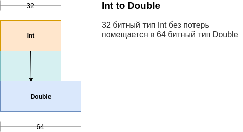
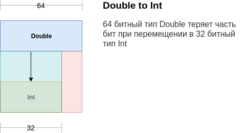

# Преобразование типов

Типы относящиеся к одной категории так же как и различную валюту можно конвертировать друг в друга. И точно также при этом могут возникнуть не состыковки. Представьте что вам необходимо обменять евро на доллары которые стоят в два раза дешевле. При этом они существуют только в виде купюр номиналом в один доллар. При таких условиях за одно евро вы получите два доллара. В случае роста курса доллара обмен без остатка стал бы невозможен. Если бы евро стоило полтора доллара, то при обмене вы бы получили только один доллар, так как номинала в половину доллара не существует. Другими словами вы бы потеряли часть своих доходов. Точно также и с типами при конвертации которых может происходить частичная потеря данных.

Преобразование типов — очень важная часть типизированного мира.

_Преобразование типов_ (type conversion, typecasting) — это процесс заключающийся в преобразовании (конвертации) значения одного типа в значение другого типа. Преобразование очень важная часть типизированного мира, работать с которой приходится постоянно. Поэтому понимать тонкости данного процесса очень важно.

Преобразование типов делятся на _явные_ и _неявные_ преобразования.

## Неявные Преобразования

_Неявные преобразования_ не требуют никаких языковых конструкций и не приводят к утрате данных. Это как если бы в магазине принимали и доллары и евро, что избавило бы покупателей от процесса обмена.

Примером неявного преобразования может служить преобразование значения типа `int` в тип `double`. Являясь 64-битным вещественным типом, `double` может хранить любое значение 32-битного целочисленного типа `int`.

Как показано на изображении выше, преобразование `int` в `double` не приводит к потере данных, так как 32-битное значение умещается в 64 битах.

## Явные Преобразования

_Явные преобразования_, которые для ясности часто называют _приведением типов_, происходят при участии разработчика и требуют указания языковых конструкций, называемых _операторами приведения_. Приведение типов требуется тогда, когда в процессе преобразования данные могут быть утрачены или по каким-то причинам процесс может завершиться ошибкой. По аналогии из жизни данный процесс сопоставим с ранее приведенным примером в котором евро стоило полтора доллара, то есть обмен без потери не возможен.

Самым простым примером явного преобразования служит преобразование типа `double`, используемого для хранения 64-битных значений с плавающей запятой, к целочисленному типу `int`.

Изображение выше демонстрирует потерю данных при преобразовании 64-битного типа `double` к 32-битному типу `int`.
